# Atividade Docker + CI — Rafael Nóbrega

Preencha todos os campos marcados com `[ ... ]` e substitua os prints de exemplo pelos seus.

> Salve as imagens em `docs/imagens/` e mantenha os nomes de arquivo indicados.

---

## Informações

- **Aluno(a):** Rafael Nóbrega de Lima
- **Turma:** Noturna
- **Data:** 24/07/2026
- **Aplicação utilizada:** docker/getting-started-app (To-Do em Node.js)

---

# 1. Como executar este projeto

```bash
git clone https://github.com/KylixXD/meu-projeto-docker.git
cd meu-projeto-docker
cp .env.example .env
docker compose up -d --build
```

Acesse:

```
http://localhost:3000
```

Para derrubar os containers:

```bash
docker compose down
```

Mantém os dados.

Ou:

```bash
docker compose down -v
```

Apaga também os volumes e os dados.

---

# 2. Imagem e Dockerfile Multi-Stage

**Estágios utilizados:**

- Builder: instala as dependências da aplicação Node.js.
- Final: copia apenas o código-fonte e as dependências necessárias para executar a aplicação, gerando uma imagem mais enxuta.

**Imagem base**

```
node:20-alpine
```

**Usuário de execução**

```
appuser [não-root]
```

**Tamanho final da imagem**

```
161 MB
```
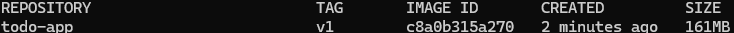

### Por que o Multi-Stage ajuda?

> O Dockerfile Multi-stage reduz o tamanho total da imagem final, pois ela usará uma etapa apenas para instalar as dependências e outra somente com os arquivos necessários para executar a aplicação, assim tornando a imagem bem mais leve e segura.


### Print 1 — Build + Docker Images

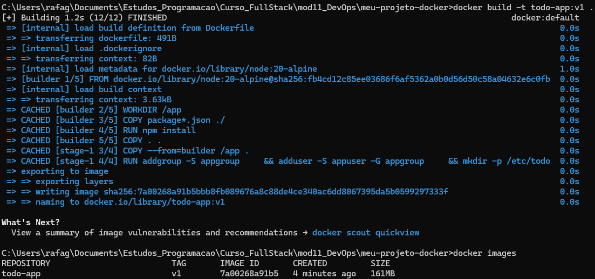

### Print 2 — Aplicação rodando

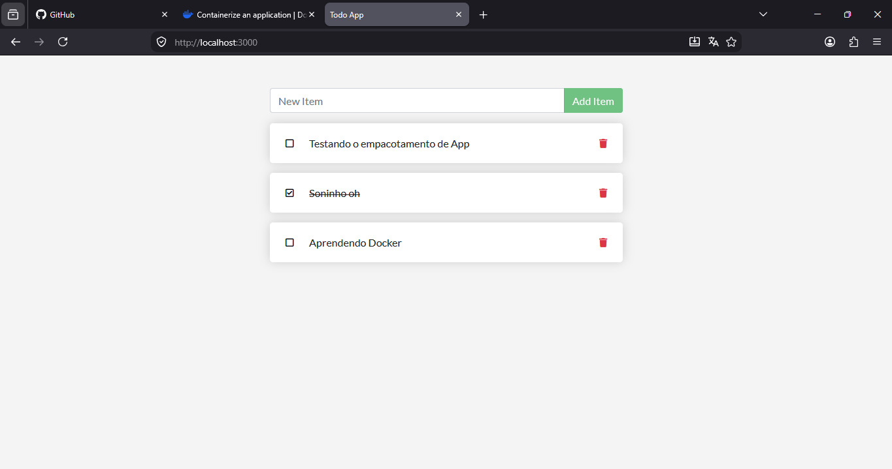

---

# 3. Volumes e Persistência

**Volume utilizado**

```
todo-db
```

**Montado em**

```
/etc/todos
```

### Print 3 — Sem Volume

Após recriar o container, os dados desapareceram.

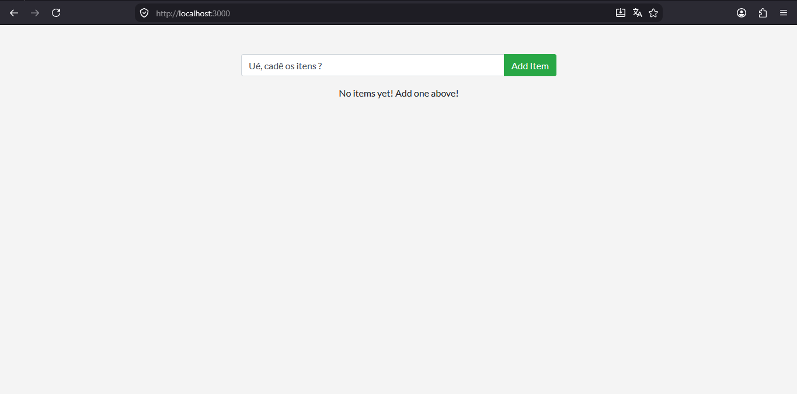

### Print 4 — Com Volume

Após recriar o container, os dados permaneceram.
Criação do volume:
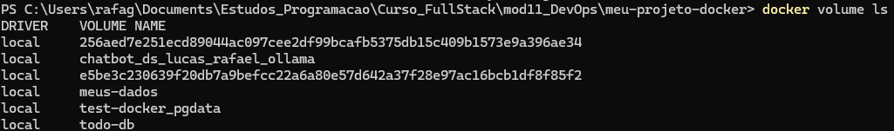

Teste de Volume antes de recriar a build: 
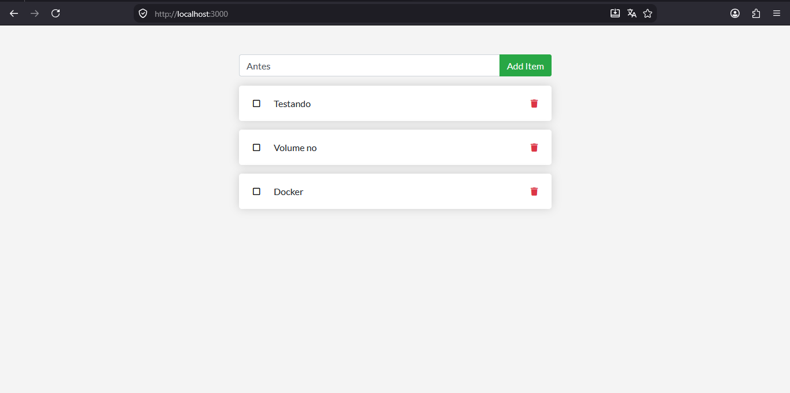

Teste de Volume depois de recriar a build: 
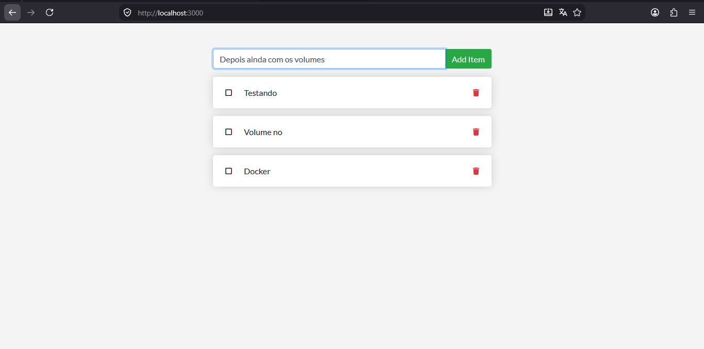


### Diferença entre `docker compose down` e `docker compose down -v`

> O comando docker compose down remove apenas os containers e a rede, mantendo os volumes e os dados. Já docker compose down -v remove também os volumes, apagando permanentemente os dados armazenados.

---

# 4. Rede

**Rede criada**

```
todo-net
```

**Serviços conectados**

- app
- db

### A porta do banco está exposta ao host?

> Não. O Banco de dados está acessível apenas pela rede interna do Docker, permitindo que somente a aplicação consiga se conectar a ele.

### Por que o app consegue chamar o host `mysql` / `db` sem saber o IP?

> Porque o Docker fornece um DNS interno para as redes criadas, permitindo que os containers se comuniquem utilizando o nome do serviço(db) ou o alias da rede, sem precisar conhecer o endereço IP.

### Print 5 — docker network inspect


### Print 6 — SELECT no MySQL

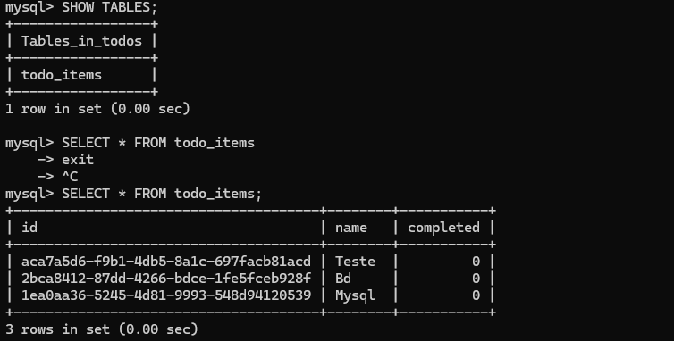

---

# 5. Docker Compose

**Serviços**

- app
- db

**Rede**

```
todo-network
```

**Volume**

```
todo-mysql-data
```

**Healthcheck**

```
db
```

**depends_on**

```
condition: service_healthy
```

**Variáveis sensíveis**

Carregadas através do arquivo `.env`, que não é versionado.

O arquivo `.env.example` serve como modelo.

### Print 7 — docker compose ps

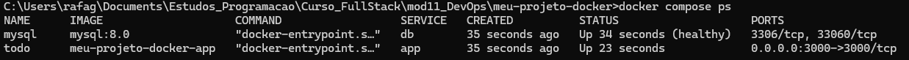


---

# 6. Integração Contínua (GitHub Actions)

**Workflow**

```
.github/workflows/ci.yml
```

### Gatilhos

- push
- pull_request

### O pipeline faz

1. Valida o arquivo compose.yml
2. Builda a imagem
3. Sobe a stack utilizando Docker Compose
4. Aguarda a aplicação responder
5. Cria uma tarefa via API (Smoke Test)
6. Derruba a stack

### Print 8 — Execução verde

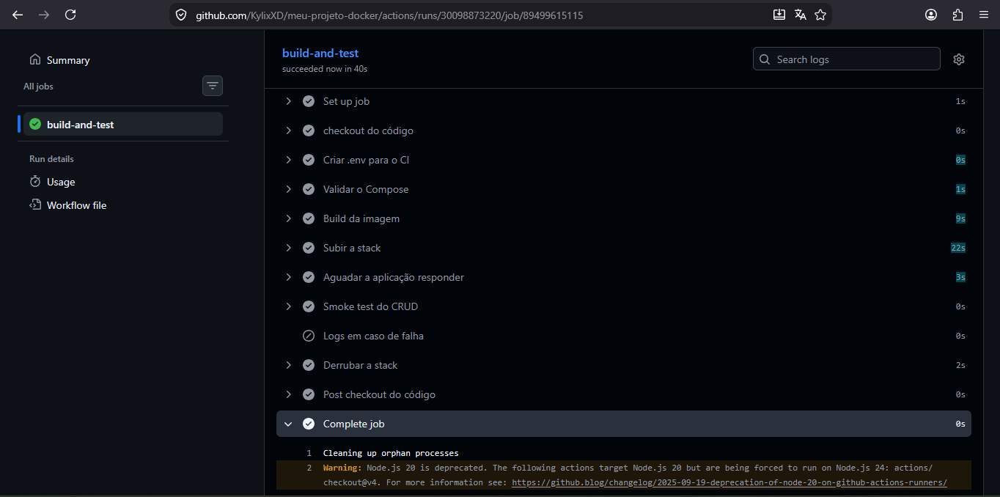

---

# 7. Quebra proposital do CI

### O que foi alterado?

> Quando estava escrevendo o CI.yml eu acabei colocando um espaço entre $ e o ( no comando $(seq 1 30)  

### Erro apresentado

```
[Cole aqui a mensagem do erro.]
```

### Como o CI reagiu?

> [Explique em qual etapa falhou.]

### Como foi corrigido?

> [Explique.]

### Link do Pull Request

```
[URL]
```

### Print 9 — Execução vermelha

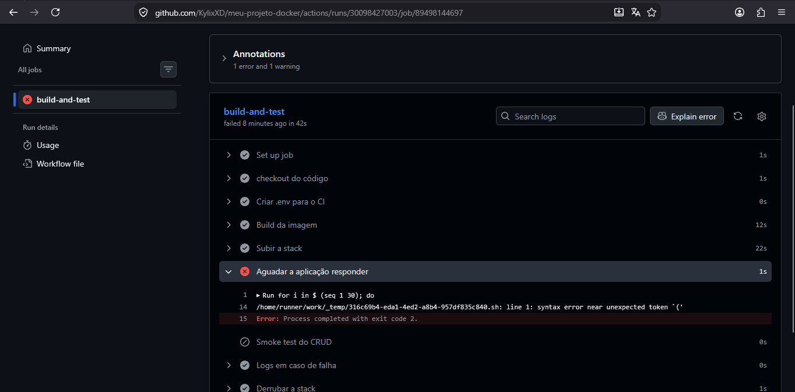


---

# 8. Dificuldades e aprendizados

Escreva entre 3 e 5 linhas descrevendo:

- O que foi mais difícil.
- Como resolveu os problemas.
- O que aprendeu sobre Docker.
- O que aprendeu sobre Docker Compose.
- O que aprendeu sobre GitHub Actions.

---

# 9. Checklist

- [ ] Dockerfile Multi-Stage funcionando
- [ ] `.dockerignore` presente
- [ ] Container não roda como root
- [ ] Volume nomeado com persistência demonstrada
- [ ] Rede nomeada
- [ ] Banco não exposto ao host
- [ ] `compose.yaml` sobe tudo com um comando
- [ ] `.env` no `.gitignore`
- [ ] `.env.example` versionado
- [ ] CI funcionando (verde)
- [ ] Pull Request com CI vermelho documentado
- [ ] Todos os 9 prints adicionados ao README